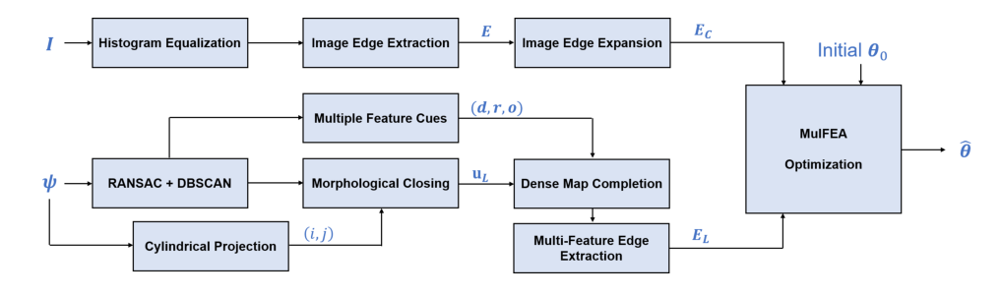
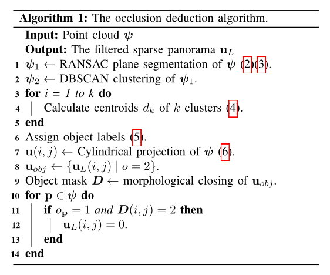
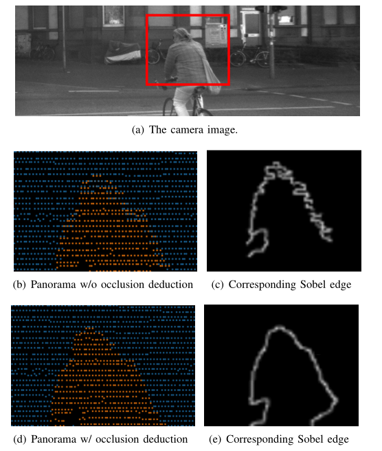
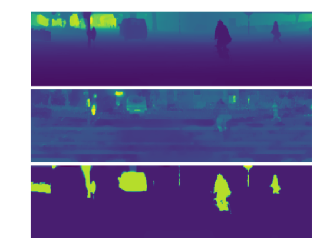
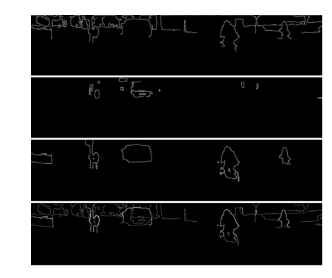

# Multi-Feature Edge AlignmenT for Targetless Camera-LiDAR Calibration论文阅读

该篇工作将点云投影到前视图下，并重建了depth、intensity、object三种深度图，极大程度上利用了三维点云的各种特征，这是这篇工作的最出彩的地方。只不过点云的稀疏特性，投影到前视图大多数也是稀疏的，无法利用文章中直接采用的2D边缘检测方法，因此需要将稀疏的深度图重建为稠密的深度图，这一步不好做.

## 总体流程

## 图像处理流程

从上面的流程图可以看到，图像处理流程比较简单，只有三步，这里只解释一下最后一步。前两篇论文对图像边缘或者语义信息的处理都是使用逆距离变换的方法，这里仅仅使用高斯模糊对图像边缘进行处理。

## 点云处理流程

1. 平面分割：对于lidar点云应用基于RANSAC算法的平面分割方法
2. 前景和后景物体分类：使用DBSCAN聚类算法对点云进行处理，然后计算每个簇的中心点的距离，作为前景和后景的分割标准。
3. 柱面投影和遮挡推断：由于相机的位置和lidar位置是不一致的，所以当lidar点云投影到图像中会出现部分遮挡的情况（如下图所示），这里使用前景点云作为mask（就是利用图形学闭操作，将像素之间的small gap连接起来），将mask下面的后景点云设置为无效。

然后对lidar点云的特征图（稀疏深度图，反射率图，前景图）重建为稠密特征图。重建方式如下：
$$
\begin{aligned}
\hat{\boldsymbol{\phi}}= & \operatorname{argmin} \operatorname{me\Phi }_{\phi \in \Phi}\left\{\left\|\mathbf{u}_{L}-\mathbf{H} \odot \boldsymbol{\phi}\right\|_{2}^{2}\right. \\
& \left.+\lambda \sum_{i=1}^{N_{x}} \sum_{j=1}^{N_{y}}\left(\left\|\left[\boldsymbol{\nabla}_{x} \boldsymbol{\phi}\right]_{i, j}\right\|_{1}+\left\|\left[\boldsymbol{\nabla}_{y} \boldsymbol{\phi}\right]_{i, j}\right\|_{1}\right)\right\}
\end{aligned}
$$
其中$H$是已知的二元掩膜矩阵（这里说的很模糊，不知道从哪里来的），${u}_{L}$是经过遮挡推断的稀疏全景图，$\phi$是需要重建的稠密图。下面的两个是稠密图的梯度。整个问题被表述为ROF（Rudin Osher Fatemi）图像恢复模型的变体。通过最小化数据保真度损失和总变化准则，可以恢复密集全景地图。整个问题可以用FISTA或Split Bregman算法在很少的迭代中进行优化。我们应用中的开源工具箱来解决这些优化问题

在稠密特征图中用sobel算子来提取边缘，然后对三个特征通道的边缘图进行融合。

## 目标函数

由于激光雷达和相机是两种不同模态的数据，所以直接进行边缘对齐肯定存在问题，所以首先对相机和激光雷达的数据采取了多个预处理步骤，他们将从多特征线索中识别出的边缘点投影到相机图像平面上，最大化由相应图像边缘强度值和多特征边缘概率的内积定义的线性相似性。作者使用归一化因子来表示“正确匹配”点的百分比，定义为匹配点的数量与边缘点总数的比率。 这个比率也可以解释为精度。通过构建相机图像的边缘强度与从多特征 LiDAR 点云获取的边缘概率之间的线性相关性来设计成本函数。 具体地，确定为点云中灰度边缘的强度与是物体边缘的概率的乘积之和。

$$
J(\boldsymbol{\theta})=\frac{N_{m}}{N_{e}} \sum_{n=1}^{N} E_{C}(\boldsymbol{\theta})_{n} \cdot P\left(E_{L}\left(i_{n}, j_{n}\right)\right)
$$
进行优化的时候采用了BB梯度下降法。

