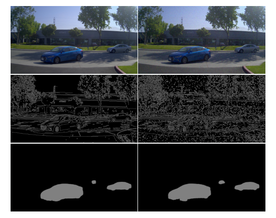
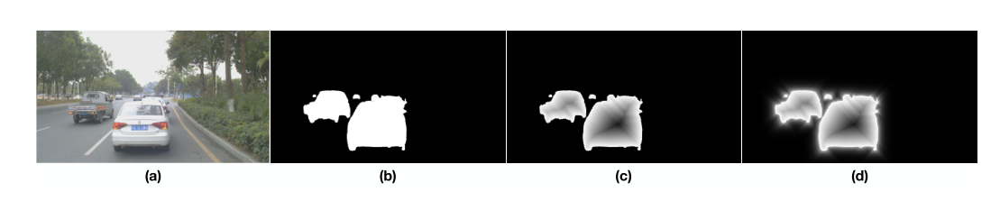
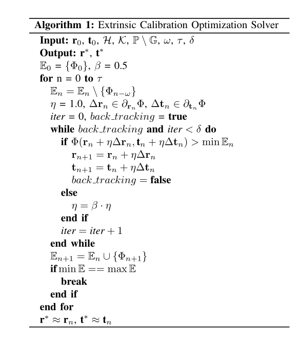

# Online Camera-LiDAR Calibration with Sensor Semantic Information论文阅读

本文可谓是大道至简，利用语义特征代替边缘特征进行相机和激光雷达联合标定。这篇论文基于Automatic-Online-Calibration-of-Cameras-and-Lasers进行改进，主要做出了一下贡献：

1. 利用语义特征代替边缘特征，提升方法的整个鲁棒性
2. 将非线性优化方法用于离散采样的目标函数

## 点云处理

这篇文章没有提到怎么处理点云，只是非常简单的提了一句。直接使用的是经过分类的点云，因为这篇文章重点提到的行驶中的车辆，打算利用行驶中的车辆来做一个联合标定。所以大概是从原始点云中利用点云分割分割出车辆的点云，然后进行之后的图像采样。

## 图像信息处理

文章使用PSPNet来对图像进行处理，以得到图像的语义信息。	

对于语义得到的结果进行处理，车辆语义内部进行逆距离变换（为了加强局部最优性的唯一性），外部不变，处理方法如下：
$$
h_{S S}=\mathcal{H}_{S S}\left(\mathbf{p}_I\right)=\left\{\begin{array}{ll}
0, & \mathbf{p}_I \in \mathbb{B} \\
1, & \mathbf{p}_I \in \mathbb{O}
\end{array}\right. \text {. }
$$

$$
\begin{gathered}
h_{D T}=\mathcal{H}_{D T}\left(\mathbf{p}_I\right)=\alpha_1 \mathcal{H}_{S S}\left(\mathbf{p}_I\right) \\
+\left(1-\alpha_1\right) \max _{\mathbf{q}_I \in \mathbb{B}} \mathcal{H}_{S S}\left(\mathbf{q}_I\right) \gamma_1^{\left\|\mathbf{p}_I-\mathbf{q}_I\right\|_1}, \mathbf{p}_I \in \mathbb{O},
\end{gathered}
$$

$$
\begin{gathered}
h_{I D T}=\mathcal{H}_{I D T}\left(\mathbf{p}_I\right)=\alpha_0 \mathcal{H}_{S S}\left(\mathbf{p}_I\right) \\
+\left(1-\alpha_0\right) \max _{\mathbf{q}_I \in \mathbb{O}} \mathcal{H}_{S S}\left(\mathbf{q}_I\right) \gamma_0^{\left\|\mathbf{p}_I-\mathbf{q}_I\right\|_1}, \mathbf{p}_I \in \mathbb{B}
\end{gathered}
$$

$$
h_{}=\mathcal{H}_{}\left(\mathbf{p}_I\right)=\left\{\begin{array}{ll}
h_{IDT}, & \mathbf{p}_I \in \mathbb{B} \\
h_{DT}, & \mathbf{p}_I \in \mathbb{O}
\end{array}\right. \text {. }
$$

处理结果如下：

目标函数还是在经过投影在经过处理后的图像上进行采样。

## 非线性优化算法

看过上一篇文章中论文的都知道，他是在六个变换变量中进行扰动，然后选取目标值更大的方向进行移动，这样做的结果就是很可能达到局部最优解，当然文章最后也给出了一些方法来解决这一困境。这篇文章将非线性优化的方法应用到离散采样得到的目标函数。整体算法如下：

他这里是用次微分得到的结果然后选取坐标上升方向进行优化，（[次微分次梯度看这里](https://blog.csdn.net/weixin_41024483/article/details/105442819)）。一般来说，我们只要线性搜索大于当前目标值就可以进行迭代了，但是很可能陷入到局部最优的环境。这里的回溯算法加上窗口滑动算法缓解了这一问题，建议看一下。

