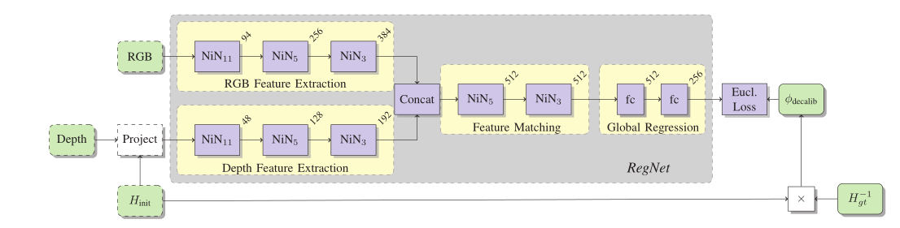

# RegNet: Multimodal Sensor Registration Using Deep Neural Networks论文阅读

Regnet是第一个使用神经网络来进行相机和激光雷达在线联合标定的论文，这篇论文的思路也是非常的简单，就是分别提取图像和点云投影后的稀疏图特征，然后进行特征融合，最后通过全连接层来拟合$decalib$。这篇论文的另外一个贡献就是改写了在线矫正问题，以产生理论上无限的数据集。

## 另一个角度看在线标定问题

由于有数据集的限制，所以这篇论文创造性地从另一个角度来看标定问题：给定$H_{init}$和$H_{gound truth}$，我们需要找到一个$H_{decalib}$来使$H_{init}$x$H_{decalib}$等于$H_{ground truth}$，而这个decalib就是我们需要去拟合的变量。这样我们只需要改变$H_{init}$就可以得到理论上无限的数据集。

## 网络结构

NiN块由一个k×k卷积和几个1×1卷积组成。对于RGB部分，我们使用Lin等人为ImageNet分类提出的权重和架构。因为我们只关注特征提取，所以直接跳过了最后一个NIN块。然后是特征匹配部分，在从两个输入模态中提取特征之后，连接特征图以融合来自两个模态的信息。网络的这一部分也被实现为NiN块的堆栈。通过卷积堆叠的LiDAR和RGB特征，生成联合表示。Dosovitskiy等人也引入了一个特定的相关层。最后是回归部分，这里使用了欧式损失函数。

## 源码实现

[aaronlws95/regnet: Not Totally Accurate [RegNet: Multimodal Sensor Registration Using Deep Neural Networks\] PyTorch Implementation (github.com)](https://github.com/aaronlws95/regnet)
