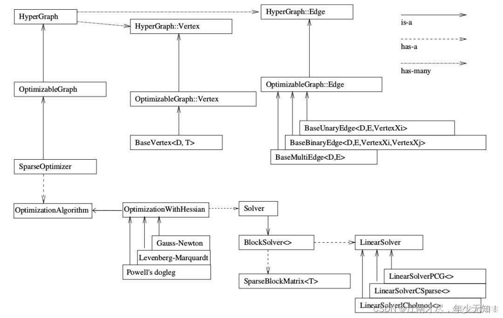
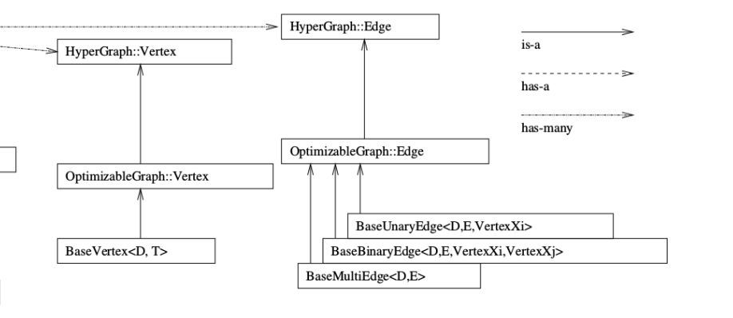
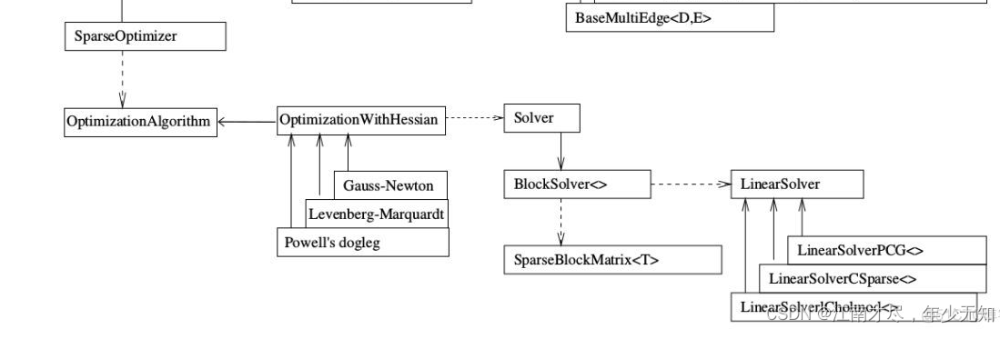
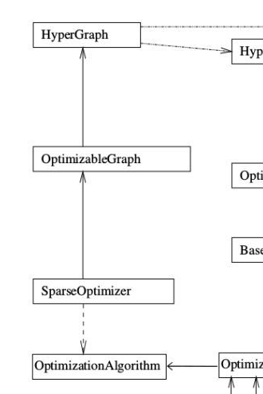
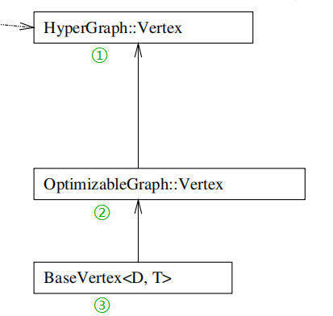
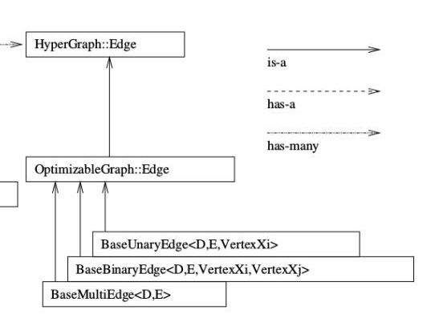
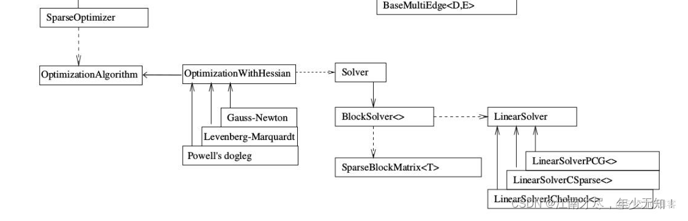

# g2o库使用



上面是g2o库的框架，非常的清晰。学习g2o库一定要先看这个框架图，而且一定要注意箭头的不同类型，有的是is-a也就是继承类型，有的是has-a和has-many是包含类型。

g2o库的使用过程一般包含以下步骤：

	1.顶点和边类型定义（也就是继承父类，重写自己的顶点和边）



	2.构建图优化实例，配置求解器，指的是下面的部分：




3.添加顶点和边，构建求解图



4.执行优化

## 顶点定义



g2o库本身有一些库的定义：

```c++
VertexSE2 : public BaseVertex<3, SE2>  //2D pose Vertex, (x,y,theta)
VertexSE3 : public BaseVertex<6, Isometry3>  //6d vector (x,y,z,qx,qy,qz) (note that we leave out the w part of the quaternion)
VertexPointXY : public BaseVertex<2, Vector2>
VertexPointXYZ : public BaseVertex<3, Vector3>
VertexSBAPointXYZ : public BaseVertex<3, Vector3>

// SE3 Vertex parameterized internally with a transformation matrix and externally with its exponential map
VertexSE3Expmap : public BaseVertex<6, SE3Quat>

// SBACam Vertex, (x,y,z,qw,qx,qy,qz),(x,y,z,qx,qy,qz) (note that we leave out the w part of the quaternion.
// qw is assumed to be positive, otherwise there is an ambiguity in qx,qy,qz as a rotation
VertexCam : public BaseVertex<6, SBACam>

// Sim3 Vertex, (x,y,z,qw,qx,qy,qz),7d vector,(x,y,z,qx,qy,qz) (note that we leave out the w part of the quaternion.
VertexSim3Expmap : public BaseVertex<7, Sim3>

```

D指的是Dimension就是要优化变量的维度，T是EstimateType指的是变量的类型。

一般重写边需要考虑一下函数就行：

```c++
virtual bool read(std::istream& is);
virtual bool write(std::ostream& os) const;
	IO操作一般不需要重写，声明一下就行
virtual void oplusImpl(const number_t* update);
·	顶点更新函数，就是待优化变量的更新操作，根据边求出增量之后，用这个函数对变量进行更新
virtual void setToOriginImpl();
	顶点重置函数，顶点被重置为优化变量的原始值
```

实例代码如下：

```c++
class CurveFittingVertex: public g2o::BaseVertex<3, Eigen::Vector3d>
{
public:
    EIGEN_MAKE_ALIGNED_OPERATOR_NEW
    virtual void setToOriginImpl() // 重置
    {
        _estimate << 0,0,0;
    }

    virtual void oplusImpl( const double* update ) // 更新
    {
        _estimate += Eigen::Vector3d(update);
    }
    // 存盘和读盘：留空
    virtual bool read( istream& in ) {}
    virtual bool write( ostream& out ) const {}
};


```

## 边的定义



BaseUnaryEdge是一元边，BaseBinaryEdge是二元边，BaseMultiEdge是多元边。

```c++
BaseBinaryEdge<2, Vector2D, VertexSBAPointXYZ, VertexSE3Expmap>
    其中2是指这个测量值是二维的，Vector2D是测量值，VertexSBAPointXYZ是边连接的一个顶点，在SLAM中一般指路标，VertexSE3Expmap是另一个顶点，一般指位姿顶点。
```

同样的，继承边需要重写以下函数

```c++
virtual bool read(std::istream& is);
virtual bool write(std::ostream& os) const;
	IO函数一般不做重写
virtual void computeError();
	根据顶点和重投影公式计算和观测值之间的误差。
virtual void linearizeOplus();
	计算当前节点值下该误差对优化变量的偏导数，也就是Jacobian
```

另外，边也有一些函数指的注意（顶点同，但是没有列出来）

```c++
_measurement：存储观测值
_error：存储computeError() 函数计算的误差
_vertices[]：存储顶点信息，比如二元边的话，_vertices[] 的大小为2，存储顺序和调用setVertex(int, vertex) 是设定的int 有关（0 或1）
setId(int)：来定义边的编号（决定了在H矩阵中的位置）
setMeasurement(type) 函数来定义观测值
setVertex(int, vertex) 来定义顶点
setInformation() 来定义协方差矩阵的逆

```

边定义的示例代码如下：

```c++
// 误差模型 模板参数：观测值维度，类型，连接顶点类型
class CurveFittingEdge: public g2o::BaseUnaryEdge<1,double,CurveFittingVertex>
{
public:
    EIGEN_MAKE_ALIGNED_OPERATOR_NEW
    CurveFittingEdge( double x ): BaseUnaryEdge(), _x(x) {}
	// 计算曲线模型误差
	virtual void computeError() override {
	  const CurveFittingVertex *v = static_cast<const CurveFittingVertex *> (_vertices[0]);
	  const Eigen::Vector3d abc = v->estimate();
	  _error(0, 0) = _measurement - std::exp(abc(0, 0) * _x * _x + abc(1, 0) * _x + abc(2, 0));
	}
	
	// 计算雅可比矩阵
	virtual void linearizeOplus() override {
	  const CurveFittingVertex *v = static_cast<const CurveFittingVertex *> (_vertices[0]);  //取出顶点
	  const Eigen::Vector3d abc = v->estimate();  //得到顶点要优化的参数
	  double y = exp(abc[0] * _x * _x + abc[1] * _x + abc[2]);  //因为这里要拟合的函数是y=exp(ax^2+bx+c)+w
	  _jacobianOplusXi[0] = -_x * _x * y;
	  _jacobianOplusXi[1] = -_x * y;
	  _jacobianOplusXi[2] = -y;    //注意这里都取负号了
	}

    virtual bool read( istream& in ) {}
    virtual bool write( ostream& out ) const {}
public:
    double _x;  // x 值， y 值为 _measurement
};
```

## 添加边和顶点，构造优化图



```c++
 // 第二部分；配置优化器，构建图优化
    // 定义重载求解变量块，每个误差项优化变量维度为3，误差值维度为1
    typedef g2o::BlockSolver<g2o::BlockSolverTraits<3, 1>> BlockSolverType;
    // 定义线性求解器类型
    typedef g2o::LinearSolverDense<BlockSolverType::PoseMatrixType> LinearSolverType;
    //创建高斯牛顿求解器
    auto solver = new g2o::OptimizationAlgorithmGaussNewton(g2o::make_unique<BlockSolverType>(g2o::make_unique<LinearSolverType>()));
    // 图模型
    //创建稀疏优化器
    g2o::SparseOptimizer optimizer;
    // 设置求解器
    optimizer.setAlgorithm(solver);
    // 打开调试输出
    optimizer.setVerbose(true);
//　第三部分；添加点和边
    // 实例化顶点，往图中增加顶点
    CurveFittingVertex *v = new CurveFittingVertex();
    //配置初始估计值
    v->setEstimate(Eigen::Vector3d(aest, best, cest));
    //设置图表中节点的id确保更改id后图表保持一致
    v->setId(0);
    //添加设置完成的顶点
    optimizer.addVertex(v);

    // 往图中增加边
    for (int i = 0; i < PointNum; i++)
    {
        //实例化边，并传入标点值
        CurveFittingEdge *edge = new CurveFittingEdge(x_data[i]);
        //设置图表中边的id确保更改id后图表保持一致
        edge->setId(i);
        // 设置连接的顶点，１、顶点编号２、顶点实例化
        edge->setVertex(0, v);
        // 传入观测到的数值
        edge->setMeasurement(y_data[i]);
        // 设置信息矩阵：协方差矩阵之逆
        edge->setInformation(Eigen::Matrix<double, 1, 1>::Identity() * 1 / (w_sigma * w_sigma));
        //将设置完成的边加入
        optimizer.addEdge(edge);
    }

  // 执行优化
  cout << "start optimization" << endl;
  chrono::steady_clock::time_point t1 = chrono::steady_clock::now();
  optimizer.initializeOptimization();  
  optimizer.optimize(10);   //优化次数
  chrono::steady_clock::time_point t2 = chrono::steady_clock::now();
  chrono::duration<double> time_used = chrono::duration_cast<chrono::duration<double>>(t2 - t1);
  cout << "solve time cost = " << time_used.count() << " seconds. " << endl;

  // 输出优化值
  Eigen::Vector3d abc_estimate = v->estimate();
  cout << "estimated model: " << abc_estimate.transpose() << endl;

```

