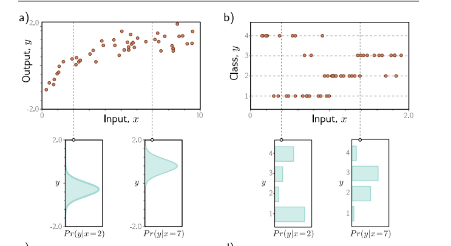
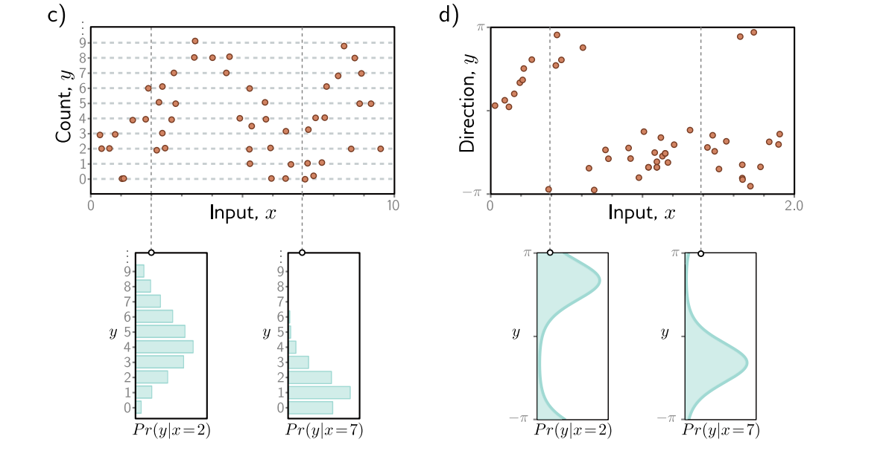

# 损失函数

本文基于[understand deeplearning](https://udlbook.github.io/udlbook/)第五章 **loss functions**，真的强烈推荐这本书。

## 最大似然估计

再谈损失函数之前不得不提到最大似然估计。最大似然估计是基于极大似然原理（**世界上正在发生的事件，之所以发生，是因为它发生的概率大**）的一种点估计方法。我们的目标是让已经发生事件总体发生概率最大。

[(212条消息) 0基础看-最大似然函数，原理，基本概念，例子_linweieran的博客-CSDN博客_最大似然函数](https://blog.csdn.net/linweieran/article/details/101521979)

具体可以看上面博客，写的还是蛮不错的。

## 从概率角度看损失函数

首先介绍损失函数，为什么要有损失函数这个东西？因为神经网络的任务可以说是根据样本来拟合函数，也就是调整神经网络中的参数。当参数调整过程中我们需要知道现在的模型距离我们预期的模型差距还有多大，自然而然的想到使用一个函数来判断目前的模型输出结果和样本标签的差距，这个函数就是损失函数。

不知道你有没有想过为什么单变量输出回归任务要用最大平方损失函数呢？下面我们将会做出解释。

之前我们都是直接用模型输出来预测y也就是样本标签，现在我们从条件概率转移的角度来看。样本可以表示为[x,y]的样式，x是特征，y是标签。由于各方面原因，误差总是存在的，对于同一个x不会总是得到y相同。**对于给定的x，我们将样本看成独立同分布的随机变量。**

改变角度之后，我们现在的任务就是首先使用一个概率分布来描述这些数据，对于图a我们想要使用正态分布，所以描述这些数据的参数就是{$\mu,\sigma^{2}$}，我们想要使用最大似然来估计这两个参数。
$$
\begin{aligned}
\hat{\boldsymbol{\theta}} & =\underset{\theta}{\operatorname{argmax}}\left[\prod_{i=1}^{I} \operatorname{Pr}\left(\mathbf{y}_{i} \mid \mathbf{x}_{i}\right)\right] \\
& =\underset{\theta}{\operatorname{argmax}}\left[\prod_{i=1}^{I} \operatorname{Pr}\left(\mathbf{y}_{i} \mid \boldsymbol{\theta}_{i}\right)\right] 
\end{aligned}
$$
然后我们用神经网络去拟合这两个参数以实现最大似然，也就是$\boldsymbol{\theta}_{i}=\mathbf{f}\left[\mathbf{x}_{i}, \boldsymbol{\phi}\right]$，联合上式，最后为：
$$
\begin{aligned}
\hat{\boldsymbol{\phi}} & =\underset{\phi}{\operatorname{argmax}}\left[\prod_{i=1}^{I} \operatorname{Pr}\left(\mathbf{y}_{i} \mid \mathbf{x}_{i}\right)\right] \\
& =\underset{\phi}{\operatorname{argmax}}\left[\prod_{i=1}^{I} \operatorname{Pr}\left(\mathbf{y}_{i} \mid \boldsymbol{\theta}_{i}\right)\right] \\
& =\underset{\phi}{\operatorname{argmax}}\left[\prod_{i=1}^{I} \operatorname{Pr}\left(\mathbf{y}_{i} \mid \mathbf{f}\left[\mathbf{x}_{i}, \phi\right]\right)\right] .
\end{aligned}
$$
在计算最大似然的时候，我们为了防止非常大或者非常小的数字出现，我们通常会转为对数来计算。因为对数函数是单调函数，所以极值点不会改变，而且也方便计算。这里就不过多介绍了。

下面我们来推导为什么使用最小平方误差函数：

假设y关于x是正态分布的，那么可以得到如下结果：
$$
\operatorname{Pr}\left(y \mid \mathrm{f}[\mathbf{x}, \boldsymbol{\phi}], \sigma^2\right)=\frac{1}{\sqrt{2 \pi \sigma^2}} \exp \left[-\frac{(y-\mathrm{f}[\mathbf{x}, \boldsymbol{\phi}])^2}{2 \sigma^2}\right] .
$$

$$
\begin{aligned}
L[\boldsymbol{\phi}] & =-\sum_{i=1}^I \log \left[\operatorname{Pr}\left(y_i \mid \mathrm{f}\left[\mathbf{x}_i, \boldsymbol{\phi}\right], \sigma^2\right)\right] \\
& =-\sum_{i=1}^I \log \left[\frac{1}{\sqrt{2 \pi \sigma^2}} \exp \left[-\frac{\left(y_i-\mathrm{f}\left[\mathbf{x}_i, \boldsymbol{\phi}\right]\right)^2}{2 \sigma^2}\right]\right] .
\end{aligned}
$$

$$
\begin{aligned}
\hat{\phi} & =\underset{\phi}{\operatorname{argmin}}\left[-\sum_{i=1}^I \log \left[\frac{1}{\sqrt{2 \pi \sigma^2}} \exp \left[-\frac{\left(y_i-\mathrm{f}\left[\mathbf{x}_i, \phi\right]\right)^2}{2 \sigma^2}\right]\right]\right] \\
& =\underset{\phi}{\operatorname{argmin}}\left[-\sum_{i=1}^I \log \left[\frac{1}{\sqrt{2 \pi \sigma^2}}\right]-\frac{\left(y_i-\mathrm{f}\left[\mathbf{x}_i, \boldsymbol{\phi}\right]\right)^2}{2 \sigma^2}\right] \\
& =\underset{\phi}{\operatorname{argmin}}\left[-\sum_{i=1}^I-\frac{\left(y_i-\mathrm{f}\left[\mathbf{x}_i, \phi\right]\right)^2}{2 \sigma^2}\right] \\
& =\underset{\phi}{\operatorname{argmin}}\left[\sum_{i=1}^I\left(y_i-\mathrm{f}\left[\mathbf{x}_i, \phi\right]\right)^2\right]
\end{aligned}
$$

具体还有一些示例可以在[understand deeplearning](https://udlbook.github.io/udlbook/)第五章中查看，写的还是蛮清楚的。

## 交叉熵损失函数与最大似然原理

交叉熵损失基于找到参数θ的想法，该参数θ最小化了观测数据y的经验分布$q(y)$和模型分布$\operatorname{Pr}(y \mid \boldsymbol{\theta})$之间的距离。可以使用KL散度来评估两个概率分布q（z）和P（z）之间的“距离”
$$
\mathrm{KL}[q \| p]=\int_{-\infty}^{\infty} q(z) \log [q(z)] d z-\int_{-\infty}^{\infty} q(z) \log [p(z)] d z
$$
其中$q(z)$是经验分布，是基于数据集得到的分布。$p(z)$是模型分布，我们想要得到模型分布的参数，以使经验分布和模型分布的“距离“最小。
$$
\begin{aligned}
\hat{\boldsymbol{\theta}} & =\underset{\boldsymbol{\theta}}{\operatorname{argmin}}\left[\int_{-\infty}^{\infty} q(y) \log [q(y)] d y-\int_{-\infty}^{\infty} q(y) \log [\operatorname{Pr}(y \mid \boldsymbol{\theta})] d y\right] \\
& =\underset{\boldsymbol{\theta}}{\operatorname{argmin}}\left[-\int_{-\infty}^{\infty} q(y) \log [\operatorname{Pr}(y \mid \boldsymbol{\theta})] d y\right]\\
& =\underset{\boldsymbol{\theta}}{\operatorname{argmin}}\left[-\int_{-\infty}^{\infty}\left(\frac{1}{I} \sum_{i=1}^I \delta\left[y-y_i\right]\right) \log [\operatorname{Pr}(y \mid \boldsymbol{\theta})] d y\right] \\
& =\underset{\boldsymbol{\theta}}{\operatorname{argmin}}\left[-\frac{1}{I} \sum_{i=1}^I \log \left[\operatorname{Pr}\left(y_i \mid \boldsymbol{\theta}\right)\right]\right] \\
& =\underset{\boldsymbol{\theta}}{\operatorname{argmin}}\left[-\sum_{i=1}^I \log \left[\operatorname{Pr}\left(y_i \mid \boldsymbol{\theta}\right)\right]\right] .
\end{aligned}
$$
这个就是最大似然函数的负对数形式，由此可见，交叉熵损失函数和最大似然是等价的。
